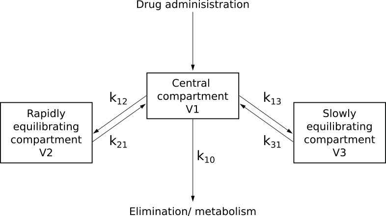
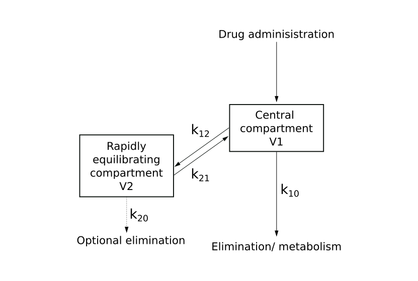
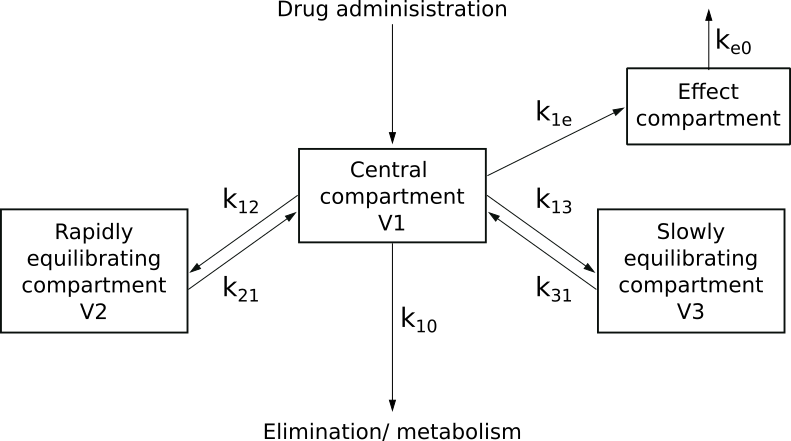

Background
==========

Over the past few decades there have been numerous publications on the 
pharmacokinetic (PK) and pharmacodynamic (PD) models of drugs used in anaesthetic 
practice. These models can predict a drug's distribution, elimination and 
clinical effect.

An important use of these models is within target controlled infusion (TCI)
systems where the optimal administration of a drug to achieve rapid 
and stable plasma and effect site concentrations are predicted. The goals 
of these system are to quickly achieve a clinical effect whilst limiting the 
side effects of the medication.

Compartment model
-----------------

The majority of anaesthetic drugs can be described by the compartment 
pharmacokinetic model with first order elimination. This can take the 
form of a two or three compartment model with the addition of an effect 
compartment.

Three
~~~~~

A drug is administered into the central compartment via the 
intravenous route. The concentration within the central compartment is
given by the mass of the drug in the central compartment divided by the 
volume of the compartment (V1). This is known as the plasma concentration. 
The plasma concentration rapidly reaches its maximum after the 
drug administration is stopped. The drug can only be removed from the system 
via the central compartment though elimination and metabolism.

Once a drug is present in the central compartment it also starts to be 
distributed to the other two compartments; occuring with rapid and slow 
equilibration. :math:`k` is the equilibrium rate constant and is the 
rate at which the drug is distributed (units :math:`min^{-1}`). 
The subscript numbers denoting the movement direction; for example 
:math:`k_{12}` is the rate at which the drug is moving from the central 
compartment to the rapidly equilibriating compartment. :math:`k_{10}` is 
the elimination and metabolism rate from the system.

Once the drug is present in the rapid and slow compartments there is 
a fraction of drug that moves back into the central compartment. After 
the administration of a drug into the central compartment stops this movement 
will maintain a slower decrement of the central compartment concentration. Once 
in the central compartment this drug can then undergo elimination and 
metabolism.

Two
~~~

The two compartment behaves in the same way as the three compartment model; 
however, with one less compartment to distribute to.

Some models require the addition of elimination from the second compartment; 
such as Hofman elimination in cisatracurium modelling. This rate constant is 
called :math:`k_{20}`.

Effect site
~~~~~~~~~~~

The central compartment is not where the action of the administered drug
occurs. This site of action can be thought of occuring within a seperate 
effect site which is linked to the central compartment.

The effect compartment is theoretical compartment with neglible volume that 
links the pharmacokinetic and pharmacodynamics of a drug. The equilibrium 
between the central and effect site compartment is described by the effect 
site equilibration rate constant :math:`k_{e0}`. 

:math:`k_{e0}` can then be used to calculate the concentration within the effect 
site compartment. Targetting the effect site concentration rather than the 
plasma concentration allows for a more rapid attainment of the drug effect at the 
cost of an overshoot in the plasma concentration. 

Mathematical expressions
------------------------

By applying mathematical models to the compartment model the plasma and 
effect site concentration after drug administration can be found. Knowing 
the drug-concentration relationship allows for prediction of dosing required 
to achieve certain concentrations.

The mathematical models used to create the target controlled infusions are 
below.

Plasma concentration
~~~~~~~~~~~~~~~~~~~~

The plasma concentration is calculated using the methods outlined by 
`Dubois et al in the PFIM software
<http://www.pfim.biostat.fr/PFIM_PKPD_library.pdf>`_. 

For multiple doses using a three compartment model the plasma concentration 
is given by:

.. math::

   C_p(t) =
   \left\{
   \begin{array}{ll}
   \sum\limits_{i=0}^{n-1}{\frac{D_i}{T_{inf_i}}
   \begin{bmatrix}
   \frac{A}{\alpha}(1-e^{-\alpha T_{inf_i}})e^{-\alpha (t - t_{D_i} - T_{inf_i})} \\
   + \frac{B}{\beta}(1-e^{-\beta T_{inf_i}})e^{-\beta (t - t_{D_i} - T_{inf_i})} \\
   + \frac{C}{\gamma}(1-e^{-\gamma T_{inf_i}})e^{-\gamma (t - t_{D_i} - T_{inf_i})}
   \end{bmatrix}} \\
   + \frac{D}{T_{inf_n}}
   \begin{bmatrix}
   \frac{A}{\alpha}(1 - e^{-\alpha(t - t_{D_n})}) \\
   + \frac{B}{\beta}(1 - e^{-\beta(t - t_{D_n})}) \\
   + \frac{C}{\gamma}(1 - e^{-\gamma(t - t_{D_n})}) \\
   \end{bmatrix} \text{if } t - t_{D_i} \leq T_{inf}, \\
   \sum\limits_{i=0}^{n}{\frac{D_i}{T_{inf_i}}
   \begin{bmatrix}
   \frac{A}{\alpha}(1-e^{-\alpha T_{inf_i}})e^{-\alpha (t - t_{D_i} - T_{inf_i})} \\
   + \frac{B}{\beta}(1-e^{-\beta T_{inf_i}})e^{-\beta (t - t_{D_i} - T_{inf_i})} \\
   + \frac{C}{\gamma}(1-e^{-\gamma T_{inf_i}})e^{-\gamma (t - t_{D_i} - T_{inf_i})}
   \end{bmatrix}} \text{if not.}
   \end{array}
   \right\} \\

where :math:`C_p(t)` = plasma concentration at time :math:`t`, 
:math:`D_i` = total dose of ith infusion, 
:math:`T_{inf_i}` = total duration of ith infusion, 
:math:`t` = current time, 
:math:`t_{D_i}` = start time of ith infusion,
:math:`A` = phase coefficient of central compartment,
:math:`B` = phase coefficient of fast compartment,
:math:`C` = phase coefficient of slow compartment,
:math:`\alpha` = phase rate constant of central compartment,
:math:`\beta` = phase rate constant of fast compartment,
:math:`\gamma` = phase rate constant of slow compartment.

For two compartment modelling the above formula is used with :math:`C = 0` so 
the third (slow) compartment evalutes to 0.

For one compartment modelling both :math:`B` and :math:`C` are set as 0; with 
:math:`\alpha = k_{10}` and :math:`A = \frac{1}{v_1}`. :math:`v_1` is the volume 
of the central compartment.

Effect site concentration
~~~~~~~~~~~~~~~~~~~~~~~~~

The effect site concentration is estimated using the semi-compartment model / 
direct pharmacodynamic fit detailed by 
`Ki
<https://doi.org/10.17085/apm.2020.15.1.1>`_.  

Given an estimate of :math:`k_{e0}` and observed values of :math:`C_p`; 
the following formulas are used recursively starting at time 
zero when the plasma and effect site concentration are also zero.

Linear solution for an increasing plasma concentration:

.. math::

   C_{e_j} = C_{e_{j-1}} \cdot e^{-k_{e0}(t_j-t_{j-1})} +
   \frac{k_{e0}}{k_{e0} - \lambda_{j_{inc}}} C_{p_{j-1}}
   \left\{
   e^{-\lambda_{j_{inc}}(t_j-t_{j-1})}
   - e^{-k_{e0}(t_j-t_{j-1})}
   \right\} 

.. math::

   \lambda_{j_{inc}} = \frac{C_{p_j} - C_{p_{j-1}}}{t_j - t_{j-1}}

Log-linear solution for a decreasing plasma concentration:

.. math::

   C_{e_j} = C_{e_{j-1}} \cdot e^{-k_{e0}(t_j-t_{j-1})} +
   (C_{p_{j-1}} - \frac{\lambda_{j_{dec}}}{k_{e0}} )
   \left\{
   1 - e^{-k_{e0}(t_j-t_{j-1})}
   \right\} 
   + \lambda_{j_{dec}}(t_j-t_{j-1})

.. math::

  \lambda_{j_{dec}} = \frac{\ln{C_{p_j}} - \ln{C_{p_{j-1}}}}{t_j - t_{j-1}}  

where 
:math:`C_{e_j}` = effect site concentration at time :math:`t_j`, 
:math:`C_{e_{j-1}}` = effect site concentration at time :math:`t_{j-1}`,  
:math:`t_j` = time, 
:math:`t_{j-1}` = previous time, 
:math:`C_{p_j}` = plasma concentration at time :math:`t_j`, 
:math:`C_{p_{j-1}}` = plasma concentration at time :math:`t_{j-1}`, 
:math:`k_{e0}` = effect compartment equilibrium rate constant

Plasma targetting
~~~~~~~~~~~~~~~~~

In the three compartment model after a bolus injection the plasma concentration
is given by:

.. math::

   C_{p_{bolus}}(t) = D_{bolus} (A.e^{-\alpha (t - t_D)} + B.e^{-\beta (t - t_D)} + C.e^{-\gamma (t - t_D)})

where 
:math:`C_{p_{bolus}}(t)` = plasma concentration at time :math:`t`, 
:math:`D_{bolus}` = bolus dose, 
:math:`t` = current time, 
:math:`t_{D}` = start time of bolus dose,
:math:`A` = phase coefficient of central compartment,
:math:`B` = phase coefficient of fast compartment,
:math:`C` = phase coefficient of slow compartment,
:math:`\alpha` = phase rate constant of central compartment,
:math:`\beta` = phase rate constant of fast compartment,
:math:`\gamma` = phase rate constant of slow compartment.

An infusion of a drug represents the infinitesimal repetition of smaller 
bolus doses of :math:`D` over time :math:`t_{inf}`. The plasma concentration of 
an infusion can be calculated by integrating the above equation.

.. math::

   C_{p_{inf}}(t) = D_{{}/{t_{inf}}} \int\limits_{0}^{t_{inf}}
   {C_{p_{bolus}}(t)}dt 

where :math:`C_{p_{inf}}(t)` = plasma concentration at time :math:`t`, 
:math:`D_{{}/{t_{inf}}}` = dose per unit time,
:math:`t_{inf}` = total duration of dose.

Rearranging the equation gives the required dose per unit of time 
:math:`D_{{}/{t_{inf}}}` over time :math:`t_{inf}` to reach a plasma 
concentration :math:`C_p` at time :math:`t`:

.. math::

   D_{{}/{t_{inf}}} = \frac{C_p(t)}
   {\int\limits_{0}^{t_{inf}}
   {C_{p_{bolus}}}dt}

To take into account a situation where other infusions have occured or are 
currently occuring the required plasma concentration delta is found. This is 
the difference between the target plasma concentration :math:`C_{p_{target}}` 
and the actual plasma concentration at the specified time to reach the target 
by :math:`C_p(t_{inf} + t)`:

.. math::

   \Delta C_p = C_{p_{target}} - C_p(t_{inf} + t)

where 
:math:`C_{p_{target}}` = target plasma concentration,
:math:`C_p(t_{inf} + t)` = actual plasma concentration at time 
:math:`t_{inf} + t`.

:math:`C_p(t_{inf} + t)` is calcuated using the 
:ref:`Plasma concentration` method.

Therefore the infusion dose per unit time :math:`D_{{}/{t_{inf}}}` can be obtained 
using a target concentration giving :math:`\Delta C_p`, time of target change 
:math:`t` and duration to achieve the target over :math:`t_{inf}`:

.. math::

   D_{{}/{t_{inf}}} = \frac{\Delta C_p}
   {\int\limits_{0}^{t_{inf}}
   {A.e^{-\alpha (t - t_D)} + B.e^{-\beta (t - t_D)} 
    + C.e^{-\gamma (t - t_D)dt}}} 

Effect site targetting
~~~~~~~~~~~~~~~~~~~~~~

There are two methods used to target the effect site, original and revised, 
which are described :ref:`here<Effect site targetting>`.

These are both non-linear problems and are solved by numerical methods using 
Scipy's Newton Secant method to find the root of the following functions.

**Original**

The function takes a plasma concentration target 
:math:`C_{p_{target}}` and effect site target :math:`C_{e_{target}}`. 
Then returns the difference between :math:`C_{e_{target}}` and the 
maxima of the effect site concentration curve :math:`C_{e_{maxima}}` that 
results from the initial :math:`C_{p_{target}}`. 

By optimising the function by the variable :math:`C_{p_{target}}` 
when the function returns 0 (:math:`C_{e_{target}} - C_{e_{maxima}} = 0`) 
then :math:`C_{p_{target}}` is the minimum plasma concentration overshoot 
required to reach :math:`C_{e_{target}}`.

**Revised**

The function takes a plasma concentration target 
:math:`C_{p_{target}}`, duration of time to maintain at the target plasma 
concentration :math:`t_{inf}`, and effect site target :math:`C_{e_{target}}`. 
Then returns the difference between  :math:`C_{e_{target}}` and the maxima of 
the effect site concentration curve :math:`C_{e_{maxima}}` that results from 
the initial :math:`C_{p_{target}}` over :math:`t_{inf}`. 

By optimising the function by the variable :math:`t_{inf}` for a given 
:math:`C_{p_{target}}` when the function returns 0 
(:math:`C_{e_{target}} - C_{e_{maxima}} = 0`)  then :math:`t_{inf}` is the 
duration that the plasma concentration needs to by kept at to reach 
:math:`C_{e_{target}}`.

Maintenance infusions
~~~~~~~~~~~~~~~~~~~~~

Maintenance infusions are the infusions required to maintain a steady state 
for a desired plasma or effect site concentration target. In steady state 
the plasma and effect site should rapidly equilibriate therefore solutions 
may only need to be performed for the plasma site. 

A :math:`t_{inf}` is set which is the duration to calculate the maintenance 
infusion over. The difference between the plasma concentration target 
:math:`C_{p_{target}}` and the actual plasma concentration after :math:`t_{inf}`
:math:`C_p(t_{inf} + t)` is calcuated giving :math:`\Delta C_p`:

.. math::

   \Delta C_p = C_{p_{target}} - C_p(t_{inf} + t)

where 
:math:`\Delta C_p` is the plasma concentration difference,
:math:`C_{p_{target}}` = target plasma concentration,
:math:`C_p(t_{inf} + t)` = actual plasma concentration at time 
:math:`t_{inf} + t`.

Then by rearranging the :ref:`Plasma concentration` equation the required dose 
per unit time :math:`D_{{}/{t_{inf}}}` over duration :math:`t_{inf}` to return 
the plasma concentration back to :math:`C_{p_{target}}` can be found:

.. math::

   D_{{}/{t_{inf}}} = \frac{\Delta C_P }{
   \frac{A}{\alpha}(1 - e^{-\alpha t_{inf}}) 
   + \frac{B}{\beta}(1 - e^{-\beta t_{inf}}) 
   + \frac{C}{\gamma}(1 - e^{-\gamma t_{inf}}) 
   }

where
:math:`D_{{}/{t_{inf}}}` dose per unit time,
:math:`\Delta C_p` is the plasma concentration to increment by,
:math:`t_{inf}` is the duration to increment over,
:math:`A` = phase coefficient of central compartment,
:math:`B` = phase coefficient of fast compartment,
:math:`C` = phase coefficient of slow compartment,
:math:`\alpha` = phase rate constant of central compartment,
:math:`\beta` = phase rate constant of fast compartment,
:math:`\gamma` = phase rate constant of slow compartment.

Ke0 'tpeak' method
~~~~~~~~~~~~~~~~~~

Traditionally the :math:`k_{e0}` was calculated using parametric, nonparametric 
or sequential PKPD methods. An alternative method is to calculate :math:`k_{e0}` 
using the time to peak effect :math:`t_{peak}` as described by 
`Minto et al <https://doi.org/10.1097/00000542-200308000-00014>`_. 

After a patient is given a bolus of a drug :math:`D_{bol}` at time zero with 
the assumption that it immediately reaches the central compartment. 
The :math:`t_{peak}` is obtained from the resulting response-time curve. 
At :math:`t_{peak}` the plasma concentration :math:`C_p(t_{peak})` is equal to the 
effect site concentration :math:`C_e(t_{peak})`. So that for a three compartment model:

.. math::

   C_{e_{bol}}(t_{peak}) = C_{p_{bol}}(t_{peak}) = D_{bol} (A.e^{-\alpha t_{peak}} + B.e^{-\beta t_{peak}} + C.e^{-\gamma t_{peak}})

where 
:math:`C_{e_{bol}}(t_{peak})` = effect site concentration at time 
:math:`t_{peak}` after a bolus, 
:math:`C_{p_{bol}}(t_{peak})` = plasma concentration at time 
:math:`t_{peak}` after a bolus, 
:math:`D_{bol}` = bolus dose, 
:math:`t_{peak}` = time to peak effect in seconds,
:math:`A` = phase coefficient of central compartment,
:math:`B` = phase coefficient of fast compartment,
:math:`C` = phase coefficient of slow compartment,
:math:`\alpha` = phase rate constant of central compartment,
:math:`\beta` = phase rate constant of fast compartment,
:math:`\gamma` = phase rate constant of slow compartment.

Substituting in :math:`k_{e0}` gives the equation to solve:

.. math::

   C_e(t_{peak}) =
   D_{bol}
   \begin{bmatrix}
   \frac{k_{e0}A}{k_{e0} - \alpha} 
   (\alpha e^{-\alpha t_{peak}} - k_{e0} e^{-k_{e0} t_{peak}}) \\
   +
   \frac{k_{e0}B}{k_{e0} - \beta} 
   (\beta e^{-\beta t_{peak}} - k_{e0} e^{-k_{e0} t_{peak}}) \\
   +
   \frac{k_{e0}C}{k_{e0} - \gamma} 
   (\gamma e^{-\gamma t_{peak}} - k_{e0} e^{-k_{e0} t_{peak}})
   \end{bmatrix}

This equation is solved for :math:`k_{e0}` using Scipy's brentq method.
